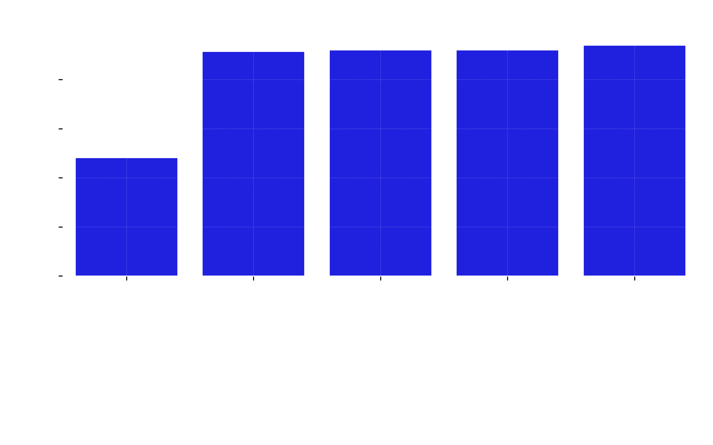
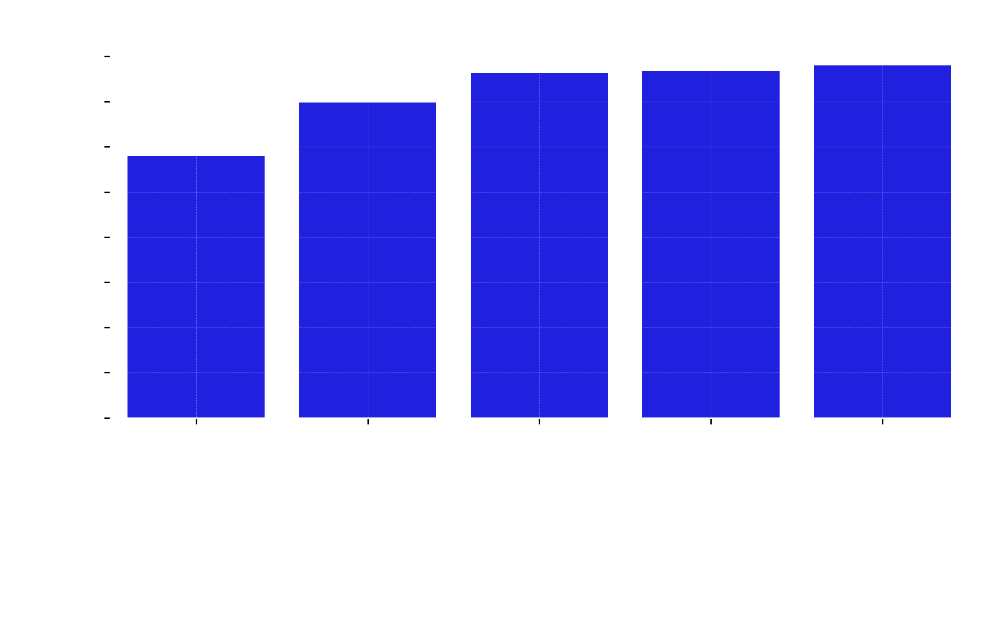
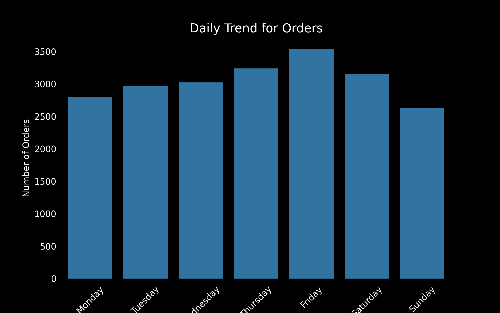
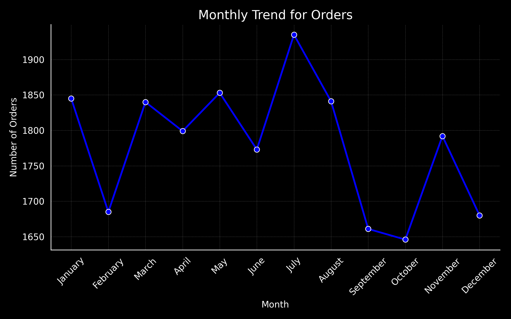
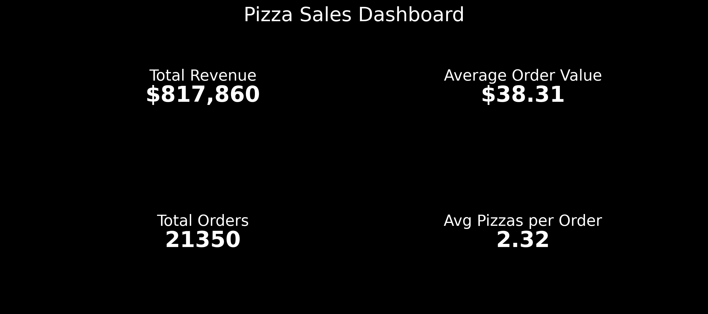
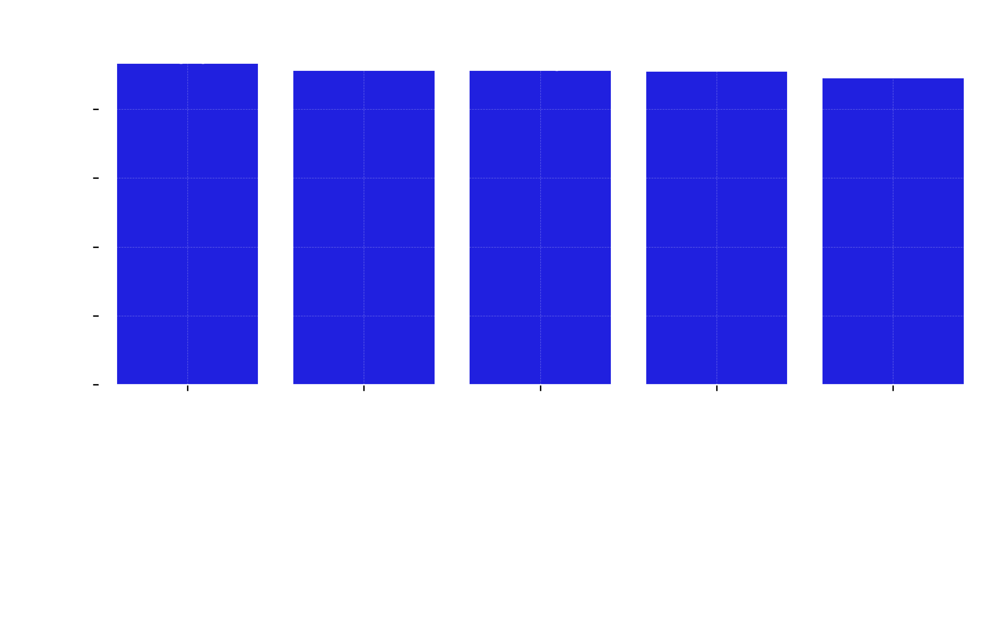
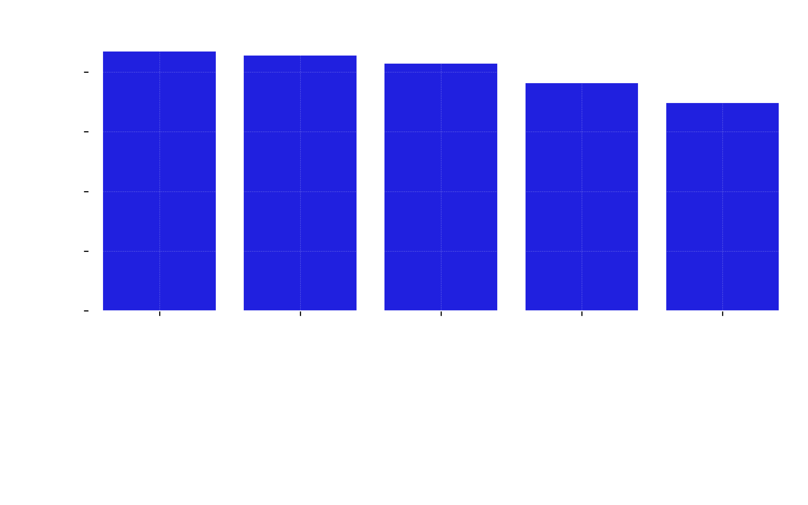

# Pizza Sales Analytics Dashboard

## Project Overview

    * This project is a complete data analysis solution for a pizza sales dataset.  
    * It explores revenue performance, customer behavior, product insights, and time-based trends using Python.

- The goal is to turn raw sales data into meaningful business insights and visual dashboards.


## Objectives
- Analyze total revenue and order patterns
- Identify best and worst performing pizzas
- Understand customer purchasing behavior
- Analyze sales by category and size
- Track daily and monthly order trends
- Build reusable and modular Python code


## Tools & Technologies
- Python
- Pandas
- Numpy
- Matplotlib
- Seaborn
- Jupyter Notebooks

# Project Structure

```
pizza-sales-analysis/
│
├── data/
│   └── pizza_sales.csv
│
├── notebooks/
│   └── analysis.ipynb
│
├── src/
│   ├── data_cleaning.py
│   ├── analysis.py
│   └── visualization.py
│
├── screenshots/
│   └── dashboard.png
│
├── requirements.txt
├── README.md
├── .gitignore
└── main.py   
```


## Key Insights

### Business KPIs
- Total Revenue
- Total Orders
- Average Order Value
- Total Pizzas Sold
- Average Pizzas per Order

### Product Analysis
- Top 5 best-selling pizzas
- Bottom 5 least-performing pizzas
- Revenue and quantity comparison

### Category & Size Analysis
- Revenue distribution by pizza category
- Sales performance by pizza size

### Time-Based Trends
- Monthly order trends
- Daily order patterns

## Dashboard Preview








_dashboard.png)





## How to Run This Project

### 1. Install dependencies
```bash
pip install -r requirements.txt
```
### 2. Run main script

```bash
python main.py
```

### 3. Or run notebook

```bash
jupyter notebook notebooks/analysis.ipynb
```

# Key Skills Demonstrated
- Data Cleaning & Preprocessing
- Exploratory Data Analysis (EDA)
- Data Visualization
- Business KPI development
- Modular Python project structure
- Real-world analytics thinking


## Author
Aram Mehraban
    - Data Analyst Portfolio Project